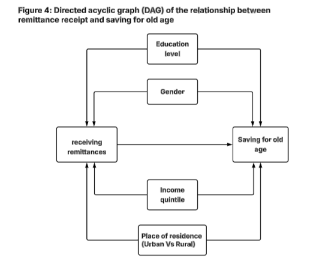

```{r setup, include=FALSE}

#This chunk of code does not do anything to our data. This code basically sets up the Quarto interface (which determines how the document looks when you render it)
#Basically, the code below determines whether the document should show the code and warning messages. 

knitr::opts_chunk$set(
  echo = TRUE,        # Don't show R code
  results = "show",    # Don't show output by default
  message = FALSE,     # Hide messages (e.g., from library calls)
  warning = FALSE      # Hide warnings
)
```

## Introduction

```{r}
rm(list=ls()) #This line of code cleans the environment

# Load libraries (or packages):
library(tidyverse) #This library contains the most important functions you'll be using, download it everytime
library(patchwork)  # This library is very useful to combine multiple plots into one

#Load the dataset:
dataset = read_csv("findex_microdata_2025.csv")
```

Population ageing reinforces the importance of households’ financial preparedness for old age, particularly in countries where formal pension systems are limited, fragmented, or largely confined to the formal sector. In this context, remittances constitute a major and relatively stable source of income for many households, playing a central role in poverty reduction, the management of economic shocks, and income security. However, their impact on long-term financial behavior, especially saving for old age, remains ambiguous and insufficiently documented.

From a theoretical perspective, the receipt of remittances is likely to alter households’ intertemporal trade-offs. By acting as a form of informal insurance or anticipated income, these transfers may reduce incentives to accumulate savings explicitly intended for retirement. This substitution mechanism is further reinforced by institutional and social factors, such as limited pension coverage, low financial literacy, and norms of intergenerational solidarity, which encourage greater reliance on family networks rather than individual long-term financial planning.

This study therefore addresses the following research question: What is the effect of receiving remittances on households’ financial preparedness for old age?

H1: Households that receive remittances are less likely to save for old age than non-recipient households.

## Descriptive Statistics

### Key variables: Remittance Receipts and Saving for Old Age

Given that remittance receipt is captured through multiple variables in the dataset, we construct a binary indicator (*remittance_any*) to provide a unified measure of households’ exposure to transfers. This variable equals one if the household reports receiving at least one type of remittance (domestic, digital domestic, or international), and zero otherwise. Observations with missing responses are treated as non-receipt in the absence of positive information, ensuring a consistent classification across households.

```{r}
dataset <- dataset %>%
  mutate(
    # Construct a binary variable capturing remittance receipt in general.
    # The objective is to measure households’ overall exposure to remittances,
    # regardless of whether transfers are domestic or international,
    # and irrespective of the channel through which they are received.
    
    remittance_any = if_else(
      # The variable takes the value 1 if the household reports receiving
      # at least one type of remittance:
      # - fh2   : domestic remittance
      # - fin29 : digital domestic remittance
      # - fh2a  : international remittance
      fh2 == 1 | fin29 == 1 | fh2a == 1,
      
      # Value 1 indicates that the household is classified as a remittance recipient
      1,
      
      # Value 0 indicates that the household reports no remittance receipt
      0,
      
      # Missing values (e.g., "Don't know" or "Refused", previously recoded as NA)
      # are treated as non-receipt when no positive information is available
      missing = 0
    )
  )

```

```{r}
library(ggplot2)
#  Plot the distribution of households receiving remittances (any type)
# This bar chart displays the number of households that receive at least one
# type of remittance versus those that do not.


dataset %>%
  # Exclude observations with missing information on remittance receipt
  # to ensure that counts are based on valid classifications
  filter(!is.na(remittance_any)) %>%
  
  # Create a bar chart using the remittance indicator as a categorical variable
  ggplot(aes(x = factor(remittance_any), fill = factor(remittance_any))) +
  geom_bar() +
  
  # Replace numeric codes (0 and 1) with meaningful labels on the x-axis
  scale_x_discrete(
    labels = c("No remittances", "Received remittances")
  ) +
  
  # Manually specify colors for visual clarity
  scale_fill_manual(
    values = c("#1F3C88", "#F4C430")
  ) +
  
  # Add title and axis labels
  labs(
    title = "Figure 1: Distribution of Households by Remittance Status",
    x = "Remittance status",
    y = "Count"
  ) +
  
  # Remove the legend since categories are already labeled on the x-axis
  theme(legend.position = "none")

```

As shown in Figure 1, the distribution indicates that most households do not receive remittances, although a non-negligible share reports receiving them.

```{r}
dataset %>%
  filter(!is.na(fin17f)) %>%
  mutate(
    fin17f = as.numeric(fin17f),
    fin17f = recode(
      fin17f,
      `1` = "Yes",
      `2` = "No",
      `3` = "Don't know",
      `4` = "Refused"
    ),
    fin17f = factor(
      fin17f,
      levels = c("Yes", "No", "Don't know", "Refused")
    )
  ) %>%
  
ggplot(aes(x = fin17f, fill = fin17f)) +
  geom_bar(width = 0.6) +
  scale_fill_manual(
    values = c(
      "Yes" = "#F4C430",
      "No" = "#1F3C88",
      "Don't know" = "#9E9E9E",
      "Refused" = "#C62828"
    ),
    drop = FALSE
  ) +
  labs(
    title = " Figure 2: Distribution of Households by Saving for Old Age",
    x = "Response",
    y = "Count",
    fill = "Saving status"
  )

```

The figure 2 shows that most households did not save for old age in the past 12 months, while a smaller but non-negligible share reported having saved. Overall, the distribution points to limited financial preparedness for old age, motivating further analysis of differences in saving behavior, particularly by remittance status.

To capture households’ saving behavior for long-term financial security, we construct a binary indicator (*save_old_age*) based on the survey response variable. The indicator takes the value one if the respondent reports having saved for old age and zero otherwise, allowing for a straightforward comparison of saving outcomes across households.

```{r}
library(dplyr)
library(ggplot2)

# This code compares saving for old age between households
# that receive remittances and those that do not.
# The figure is purely descriptive and does not imply causality.

dataset <- dataset %>%
  mutate(save_old_age = as.integer(fin17f == 1))

dataset %>%
  
  # Keep only observations with valid information on
  # remittance receipt and saving for old age
  filter(!is.na(remittance_any), !is.na(save_old_age)) %>%
  
  # Recode variables to improve readability and interpretation
  mutate(
    # Convert the remittance indicator into a labeled factor
    remittance_any = factor(
      remittance_any,
      levels = c(0, 1),
      labels = c("No remittances", "Received remittances")
    )
  ) %>%
  
  # Compute the share of households saving for old age
  group_by(remittance_any) %>%
  summarise(
    share_saving_old_age = mean(save_old_age) * 100
  ) %>%
  
  # Plot the comparison across remittance status
  ggplot(aes(x = remittance_any,
             y = share_saving_old_age,
             fill = remittance_any)) +
  
  geom_col(width = 0.6) +
  
  scale_fill_manual(
    values = c(
      "No remittances" = "#1F3C88",
      "Received remittances" = "#F4C430"
    )
  ) +
  
  labs(
    title = " Figure 3: Saving for Old Age by Remittance Status",
    x = "Remittance status",
    y = "Share of households saving for old age (%)"
  ) +

theme(legend.position = "none")

```

Among households that do not receive remittances, approximately 35–37% report having saved for old age in the past 12 months, whereas among remittance-receiving households this proportion falls to around 25–27% (Figure 3).

### Control Variables and Descriptive Characteristics

To account for differences in households’ saving behavior and to mitigate potential omitted variable bias, the analysis includes a set of control variables that capture key demographic, socioeconomic, and contextual characteristics likely to influence both the probability of receiving remittances and the capacity to save for old age. Gender is included through an indicator identifying whether the respondent is female, as gender differences in labor market participation, migration patterns, access to financial resources, and intra-household decision-making may shape both exposure to remittance flows and long-term saving behavior. Education level is incorporated as a proxy for human capital and financial literacy, since more educated individuals are not only more likely to plan and engage in formal saving but may also be connected to broader migration networks that affect remittance receipt.

The place of residence is captured through a rural–urban indicator, reflecting structural differences in economic opportunities, migration dynamics, and access to financial institutions. Living in rural areas may increase reliance on remittances while simultaneously constraining access to formal saving instruments. Household income is included to account for differences in financial capacity, as income affects both the likelihood that households receive transfers — often targeted toward lower-income families — and their ability to allocate resources toward long-term saving rather than immediate consumption.

By conditioning on these variables, the analysis aims to isolate more clearly the relationship between remittance receipt and saving for old age, recognizing that these factors jointly influence both the treatment and the outcome



```{r}
library(dplyr)
library(ggplot2)
library(scales)

dataset %>%
  # Data cleaning
  # Exclude observations with missing values
  # in order to avoid biases in the computation of proportions
  filter(!is.na(remittance_any),
         !is.na(fin17f),
         !is.na(female)) %>%
  
  # Data grouping
  # - remittance_any: receipt of remittances (0 = no, 1 = yes)
  # - female: gender (1 = Female, 2 = Male)
  group_by(remittance_any, female) %>%
  
  # Computation of the proportion of individuals who saved for old age
  # fin17f is a binary variable:
  # fin17f == 1 → saved for old age
  summarise(
    prop_saved_old_age = mean(fin17f == 1),
    .groups = "drop"
  ) %>%
  
  # Plot construction
  ggplot(aes(
    x = factor(remittance_any,
               labels = c("No remittances", "Received remittances")),
    y = prop_saved_old_age,
    fill = factor(remittance_any)
  )) +
  
  # Bar chart
  # width controls spacing for better readability
  geom_col(width = 0.7) +
  
  # Gender control using facets
  facet_wrap(
    ~ female,
    labeller = as_labeller(c(
      `1` = "Female",
      `2` = "Male"
    ))
  ) +
  
  scale_fill_manual(
    values = c(
      "0" = "#0B3C5D",  
      "1" = "#C9A227"   
    ),
    guide = "none"     # Remove legend (redundant)
  ) +
  
  # Y-axis formatting
  # Percentage display
  scale_y_continuous(
    labels = percent_format(accuracy = 1),
    limits = c(0, 1)
  ) +
  
  labs(
    x = "Reception of remittances",
    y = "Proportion saving for old age",
    title = "Figure 4: Saving for Old Age and Remittances, Controlling for Gender"
  ) +
  
  
  theme_minimal(base_size = 12)


```

As shown in Figure 4, conditional on gender, individuals who receive remittances are less likely to save for old age than non-recipients, and this pattern is observed for both women and men.

```{r}

library(dplyr)
library(ggplot2)
library(scales)

dataset %>%
  #  Data cleaning
  # Exclude observations with missing values to avoid distorted proportions
  filter(
    !is.na(remittance_any),
    !is.na(fin17f),
    !is.na(educ)
  ) %>%
  
  #  Grouping
  
  group_by(remittance_any, educ) %>%
  
  #  Compute the proportion of individuals who saved for old age
  summarise(
    prop_saved_old_age = mean(fin17f == 1),
    .groups = "drop"
  ) %>%
  
  # Build the plot
  ggplot(aes(
    x = factor(remittance_any,
               labels = c("No remittances", "Received remittances")),
    y = prop_saved_old_age,
    fill = factor(remittance_any)
  )) +
  
  #Bar chart
  geom_col(width = 0.7) +
  
  # Control for education level via facets
  # Replace numeric codes with explicit labels
  facet_wrap(
    ~ educ,
    labeller = as_labeller(c(
      `1` = "Primary education or less",
      `2` = "Secondary education",
      `3` = "Tertiary education or more"
    ))
  ) +

  scale_fill_manual(
    values = c(
      "0" = "#0B3C5D",  
      "1" = "#C9A227"   
    ),
    guide = "none"     # Remove legend (redundant)
  ) +
  
  #  Y-axis formatting
  # - Display as percentage
  # - Force limits between 0 and 100%
  scale_y_continuous(
    labels = percent_format(accuracy = 1),
    limits = c(0, 0.5)
  ) +
  
  labs(
    x = "Reception of remittances",
    y = "Proportion saving for old age",
    title = "Figure 5: Saving for Old Age and Remittances, Controlling for Education"
  ) +
  
  theme(
    axis.text.x = element_text(
      angle = 20,
      hjust = 1,
      vjust = 1
    )
)


```

Among individuals with low and medium education, receiving remittances is associated with a lower likelihood of saving for old age compared to those who do not receive remittances.

In contrast, among individuals with tertiary education or higher, the difference between remittance receivers and non-receivers is much smaller, with both groups displaying relatively high saving rates. This indicates that higher education mitigates the negative association between remittances and long-term saving, likely by enhancing financial planning capacity and intertemporal decision-making.

```{r}
library(dplyr)
library(ggplot2)
library(scales)

dataset %>%
  # Data cleaning
  # Exclude observations with missing values to avoid distorted proportions
  filter(
    !is.na(remittance_any),
    !is.na(fin17f),
    !is.na(urbanicity)
  ) %>%
  
  # Grouping
  # remittance_any: 0 = no, 1 = yes
  # urbanicity: 1 = Rural, 2 = Urban
  group_by(remittance_any, urbanicity) %>%
  
  # Compute the proportion of individuals who saved for old age
  summarise(
    prop_saved_old_age = mean(fin17f == 1),
    .groups = "drop"
  ) %>%
  
  # Build the plot
  ggplot(aes(
    x = factor(remittance_any,
               labels = c("No remittances", "Received remittances")),
    y = prop_saved_old_age,
    fill = factor(remittance_any)
  )) +
  
  # Bar chart
  geom_col(width = 0.7) +
  
  # Control for urban/rural via facets
  facet_wrap(
    ~ urbanicity,
    labeller = as_labeller(c(
      `1` = "Rural",
      `2` = "Urban"
    ))
  ) +
  
 
  scale_fill_manual(
    values = c(
      "0" = "#0B3C5D",  
      "1" = "#C9A227"   
    ),
    guide = "none"
  ) +
  
  # Y-axis formatting
  scale_y_continuous(
    labels = percent_format(accuracy = 1),
    limits = c(0, 0.5)
  ) +
  
 
  labs(
    x = "Reception of remittances",
    y = "Proportion saving for old age",
    title = "Figure 6: Saving for Old Age and Remittances, Controlling for Urbanicity"
  ) +
  
 
  theme_minimal(base_size = 12) 

```

In both rural and urban settings, individuals who receive remittances are less likely to save for old age than those who do not receive remittances (Figure 6). However, the magnitude of this difference is modest and very similar across the two contexts. Although overall saving rates are somewhat higher in urban areas, the relationship between remittance receipt and saving follows the same pattern in both rural and urban groups.

Overall, the graph shows that the pattern linking remittance receipt to saving for old age is similar in rural and urban areas, with no marked differences between the two settings.

```{r}
library(dplyr)
library(ggplot2)
library(scales)

dataset %>%
  # Data cleaning
  # Exclude observations with missing values to avoid distorted proportions
  filter(
    !is.na(remittance_any),
    !is.na(fin17f),
    !is.na(inc_q)
  ) %>%
  
  # Grouping
  # remittance_any: 0 = no, 1 = yes
  # inc_q: household income quintile (1 = poorest, 5 = richest)
  group_by(remittance_any, inc_q) %>%
  
  # Compute the proportion of individuals who saved for old age
  summarise(
    prop_saved_old_age = mean(fin17f == 1),
    .groups = "drop"
  ) %>%
  
  # Build the plot
  ggplot(aes(
    x = factor(
      remittance_any,
      labels = c("No remittances", "Received remittances")
    ),
    y = prop_saved_old_age,
    fill = factor(remittance_any)
  )) +
  
  # Bar chart
  geom_col(width = 0.65) +
  
  # Control for income quintile via facets
  # Put all quintiles on one row (cleaner layout)
  facet_wrap(
    ~ inc_q,
    nrow = 1,
    labeller = as_labeller(c(
      `1` = "Q1 (Poorest)",
      `2` = "Q2",
      `3` = "Q3",
      `4` = "Q4",
      `5` = "Q5 (Richest)"
    ))
  ) +
  
 
  scale_fill_manual(
    values = c(
      "0" = "#0B3C5D",  
      "1" = "#C9A227"   
    ),
    guide = "none"
  ) +
  
  # Y-axis formatting
  scale_y_continuous(
    labels = percent_format(accuracy = 1),
    limits = c(0, 0.5)
  ) +
  
  
  labs(
    x = "Reception of remittances",
    y = "Proportion saving for old age",
    title = "Figure 7: Saving for Old Age and Remittances, Controlling for Income Quintiles"
  ) +
  
  
  theme_minimal(base_size = 12) +
  theme(
    # Make facet headers cleaner
    strip.text = element_text(size = 11, face = "bold"),
    panel.spacing = unit(1.0, "lines"),
    
    # Prevent x labels from cluttering the small panels
    axis.text.x = element_text(angle = 20, hjust = 1, vjust = 1),
    
    # Better title balance
    plot.title = element_text(face = "bold")
  )

```

Figure 7 shows that across all income quintiles (Q1 to Q5), the proportion of households saving for old age is consistently higher among households that do not receive remittances than among those that do. The share of households saving for old age increases with income for both groups, but a persistent gap in favor of non-recipient households is observed in every income quintile.

It is also particularly insightful to explore how the relationship between remittance receipt and saving for old age differs across world regions, as regional economic structures and financial environments may shape household saving behavior in distinct ways

```{r}
library(dplyr)
library(ggplot2)
library(scales)

dataset %>%
  # Data cleaning
  # Exclude observations with missing values to avoid biased proportions
  # regionwb corresponds to the World Bank regional classification
  filter(
    !is.na(remittance_any),
    !is.na(fin17f),
    !is.na(regionwb)
  ) %>%
  
  # Grouping
  # remittance_any: 0 = no remittances, 1 = received remittances
  # regionwb
  group_by(regionwb, remittance_any) %>%
  
  # Compute the proportion of individuals who saved for old age
  # fin17f == 1 → saved for old age
  summarise(
    prop_saved_old_age = mean(fin17f == 1),
    .groups = "drop"
  ) %>%
  
  # Build the plot
  ggplot(aes(
    x = factor(
      remittance_any,
      labels = c("No remittances", "Received remittances")
    ),
    y = prop_saved_old_age,
    fill = factor(remittance_any)
  )) +
  
  # Bar chart
  geom_col(width = 0.65) +
  
  # Control for region via facets
  # Region labels are shortened for better readability
  facet_wrap(
    ~ regionwb,
    labeller = as_labeller(c(
      "East Asia & Pacific (excluding high income)" = "East Asia & Pacific",
      "Europe & Central Asia (excluding high income)" = "Europe & Central Asia",
      "Latin America & Caribbean (excluding high income)" = "Latin America & Caribbean",
      "Middle East & North Africa (excluding high income)" = "MENA",
      "Sub-Saharan Africa (excluding high income)" = "Sub-Saharan Africa",
      "South Asia" = "South Asia",
      "High income" = "High income"
    ))
  ) +
  
  scale_fill_manual(
    values = c(
      "0" = "#0B3C5D",
      "1" = "#C9A227"
    ),
    guide = "none"
  ) +
  
  # Y-axis formatting
  scale_y_continuous(
    labels = percent_format(accuracy = 1)
  ) +
  
  labs(
    x = "Reception of remittances",
    y = "Proportion saving for old age",
    title = "Figure 8: Saving for Old Age and Remittances, by World Region"
  ) +
  
  theme_minimal(base_size = 12) +
  theme(
    strip.text = element_text(size = 10, face = "bold"),
    panel.spacing = unit(1, "lines"),
    axis.text.x = element_text(angle = 20, hjust = 1, vjust = 1),
    plot.title = element_text(face = "bold")
  )


```

Figure 8 illustrates that individuals receiving remittances do not exhibit a uniform saving pattern across regions. In several regions, including East Asia & Pacific, High-income economies, and MENA, remittance recipients show slightly lower saving rates for old age than non-recipients, suggesting that remittances may partly substitute for formal long-term savings. In Sub-Saharan Africa and Latin America & the Caribbean, saving rates are broadly similar between recipients and non-recipients, indicating a weak association. By contrast, in Europe & Central Asia, individuals receiving remittances display marginally higher saving rates, suggesting that remittance income may in some contexts ease liquidity constraints and support additional saving. Overall, the descriptive evidence reveals substantial regional heterogeneity in the relationship between remittance income and retirement saving behavior.

Taken together, the descriptive evidence provides preliminary support for the hypothesis that receiving remittances is associated with a lower likelihood of saving for old age, although the strength of this relationship varies across socioeconomic groups and regions.

## Statistical Inference

To move beyond descriptive analysis, this section employs a logistic mixed model to examine whether receiving remittances is associated with saving for old age while accounting for the hierarchical structure of the data and the binary nature of the outcome variable. Logistic mixed models are particularly appropriate when the dependent variable takes discrete values, such as whether an individual saves or not, and when observations are grouped, meaning that subsets of observations share contextual characteristics beyond the observed explanatory variables that may influence the probability of the outcome. In this study, individuals are clustered within regions that may share common economic, institutional, or social environments.

This modelling approach estimates how receiving remittances relates to the probability of saving for old age while controlling for individual characteristics such as gender, age, education, income, and place of residence, and simultaneously accounting for unobserved heterogeneity across regions. By incorporating random effects at the regional level, the model captures shared contextual influences — including differences in financial development, institutional frameworks, or social norms — that may jointly shape remittance dynamics and saving behaviour. This framework allows us to assess whether the relationship between remittance receipt and saving persists once both individual-level determinants and group-level variation are taken into consideration.

As with any econometric model, the use of a logistic mixed model relies on a set of underlying assumptions. The validity of the estimates and the reliability of statistical inference depend on these assumptions being reasonably satisfied. The following section therefore examines these conditions through a series of appropriate diagnostic checks.

### Assessment of model assumptions

```{r}

library(lme4)

# Indicate that these variables represent categories (e.g. gender, education, region),
# so that the model correctly compares groups using appropriate reference categories.

dataset$regionwb   <- factor(dataset$regionwb)
dataset$female     <- factor(dataset$female)
dataset$educ       <- factor(dataset$educ)
dataset$inc_q      <- factor(dataset$inc_q)
dataset$urbanicity <- factor(dataset$urbanicity)


# Logistic mixed-effects model
# The model estimates the association between receiving remittances
# and the probability of saving for old age, while controlling for
# gender, education, income quintile, and place of residence.
# A random intercept is included to allow baseline saving levels
# to differ across regions.

modelc <- glmer(
  save_old_age ~ remittance_any + female + educ + inc_q + urbanicity + (1 | regionwb),
  data = dataset,
  family = binomial(link = "logit")
)

```

#### Exogeneity of remittance receipt

We assume that, conditional on observed individual and household characteristics and region-level random effects, remittance receipt is not systematically related to unobserved determinants of saving for old age. While this assumption cannot be tested directly, we attempt to reduce potential bias by including a comprehensive set of control variables.

#### Independence between random effects and covariates

The random intercept captures unobserved regional differences and is assumed to be independent of the explanatory variables included in the model.

#### Correct model specification

We assume that the logistic functional form appropriately captures the relationship between predictors and the probability of saving. If important nonlinearities or interactions are omitted, results may be misleading.

#### Conditional independence within regions

After accounting for regional effects, we assume that observations within each region are independent. If additional dependence remains, standard errors may be affected.

#### Model convergence and identifiability

The first step is to verify that the estimation procedure converged properly. Convergence means that the algorithm used to estimate the model successfully found a stable solution that maximizes the likelihood function. If the model does not converge, the parameter estimates and standard errors may not be reliable. We also check whether the model suffers from a “singular fit,” which occurs when the data do not contain enough information to estimate the random effects properly. This can happen when the model is too complex relative to the sample size or when variation across clusters is very small.

```{r}
# Load required packages
library(performance)
library(knitr)

# Run convergence diagnostic on the fitted model
# This function returns a logical value (TRUE/FALSE)
# with an attribute containing the maximum gradient
res <- check_convergence(modelc)

# Create a clean table with meaningful labels
# - Convert logical result into readable status
# - Extract gradient attribute and format it
tab <- data.frame(
  Status = ifelse(unname(res), "Convergence achieved", "Convergence not achieved"),
  `Maximum gradient` = signif(attr(res, "gradient"), 3)
)

# Display the table with a descriptive caption
kable(
  tab,
  caption = "Model convergence diagnostics"
)

```

The logistic mixed model converged successfully. The convergence diagnostic indicates that the optimization reached a stable solution, with a gradient close to zero, suggesting no numerical issues in the estimation.

```{r}
library(knitr)

# Run the singularity test
# This returns a logical value (TRUE/FALSE)
sing <- lme4::isSingular(modelc, tol = 1e-4)

# Display the raw test result in a clean table
# The value itself is not modified — only formatted
kable(
  data.frame(`isSingular(modelc)` = sing),
  caption = "Singularity test result"
)

```

The model does not exhibit a singular fit, indicating that the random-effects variance components are identifiable and supported by the data.

#### Overdispersion

To ensure that the variance assumptions underlying the model are appropriate, we also assess the potential presence of overdispersion. Overdispersion occurs when the variability in the outcome is larger than what the model assumes. This may indicate that some relevant factors are missing or that the model does not fully capture heterogeneity in the data. Overdispersion can lead to underestimated standard errors and overly confident conclusions.

```{r}
# Load required packages
library(performance)
library(knitr)

# Run overdispersion diagnostic
overdisp <- check_overdispersion(modelc)

# Convert the result into a clean 2-column table:
# - Statistic: the name of each reported quantity
# - Value: the corresponding numeric value
vals <- unlist(overdisp)

tab_overdisp <- data.frame(
  Statistic = names(vals),
  Value = as.numeric(vals),
  row.names = NULL
)

# Present as a neatly formatted table with a caption
kable(
  tab_overdisp,
  caption = "Overdispersion diagnostic "
)

```

The overdispersion test does not indicate any violation of the variance assumptions, as the dispersion ratio is close to one and the null hypothesis of no overdispersion cannot be rejected (p = 0.68).

#### Multicollinearity

As part of the diagnostic analysis, we examine whether multicollinearity is present among the regressors. Multicollinearity refers to strong correlations between explanatory variables. When predictors are highly correlated, it becomes difficult to separate their individual effects, and coefficient estimates may become unstable.

```{r}
# Load required packages for multicollinearity diagnostics
library(performance)
library(knitr)

# Check for multicollinearity among predictors
#
col_diag <- check_collinearity(modelc)

# Rename columns for clearer presentation
# This improves readability without altering results
colnames(col_diag) <- c(
  "Term",
  "VIF",
  "VIF CI (low)",
  "VIF CI (high)",
  "Adj. VIF",
  "Tolerance",
  "Tolerance CI (low)",
  "Tolerance CI (high)"
)


# Display results as a formatted table with a descriptive caption
kable(
 col_diag,
  caption = "Multicollinearity diagnostic "
)


```

The multicollinearity diagnostic indicates no evidence of problematic correlations among predictors, as all variance inflation factors are close to one and tolerance values remain high.

#### Overall model fit using residual diagnostics

To further check whether the model fits the data well, we use simulation-based residual diagnostics. These diagnostics help us see whether the model can reproduce the patterns observed in the data. They can also highlight potential issues such as poor fit, unexplained variation, or observations that have a strong influence on the results.

```{r}
library(DHARMa)

# Simulate residuals
res <- simulateResiduals(modelc, n = 1000)

#Global diagnostic plot 
plot(res, title = "Figure 9: Global residual diagnostics (DHARMa)")


```

Simulation-based residual diagnostics suggest that the model fits the data reasonably well. While the uniformity test indicates a statistically significant deviation, dispersion and outlier tests do not reveal major concerns, and residuals show no systematic pattern. Overall, the results support the adequacy of the model specification.

```{r}
#Dispersion test 
testDispersion(res)

```

The DHARMa dispersion test indicates no evidence of overdispersion (p \>0.05), suggesting that the model adequately captures the variability in the data

### Empirical Results

After confirming the validity of the model through diagnostic checks, we proceed to discuss the empirical findings.

```{r}
# Load required packages
# ggeffects is used to compute adjusted predictions from regression models
# ggplot2 is used for visualization
library(ggeffects)
library(ggplot2)

# Compute predicted probabilities from the model
# Predictions are calculated while holding all other covariates constant
pred <- ggpredict(modelc, terms = "remittance_any")

# Plot the adjusted predictions
# The plot shows how the predicted probability of saving for old age
# varies across remittance status, controlling for other variables
plot(pred) +
  labs(
    title = "Figure 10: Adjusted effect of remittances on saving for old age",
    x = "Remittance status",
    y = "Probability of saving for old age"
  )

```

The adjusted predictions presented in Figure 10 indicate that, holding individual characteristics and regional heterogeneity constant, individuals who receive remittances exhibit a slightly lower predicted probability of saving for old age compared to those who do not receive remittances. The decline is modest but consistent, suggesting that remittance inflows may act as a partial substitute for formal retirement saving by providing an informal source of financial support. However, the relatively wide confidence intervals highlight the presence of uncertainty and potential heterogeneity across individuals and regions, implying that the magnitude of this association should be interpreted with caution and not as definitive evidence of a causal effect.

To complement the graphical evidence, Table 1 presents the regression estimates, allowing a formal evaluation of the direction, magnitude, and statistical significance of the remittance effect.

```{r}
library(lme4)
library(modelsummary)

# Unadjusted logistic mixed-effects model
# This specification estimates the association between receiving remittances
# and the probability of saving for old age without controlling for other covariates.
# A random intercept is included to account for differences across regions.

modelb <- glmer(
  save_old_age ~ remittance_any + (1 | regionwb),
  data = dataset,
  family = binomial(link = "logit")
)


# Adjusted logistic mixed-effects model
# This specification controls for individual characteristics such as gender,
# education level, income quintile, and place of residence, while allowing
# baseline saving behavior to vary across regions through a random intercept.

modelc <- glmer(
  save_old_age ~ remittance_any + female + educ + inc_q + urbanicity + (1 | regionwb),
  data = dataset,
  family = binomial(link = "logit")
)

# Create a regression table comparing two model specifications:
# Baseline Model (without control variables)
# Controlled Model (with control variables)
# The option exponentiate = TRUE reports coefficients as odds ratios,
# which are easier to interpret in a logistic model.
modelsummary(
  list(
    "Baseline Model" = modelb,
    "Controlled Model" = modelc
  ),
  exponentiate = TRUE,
  stars = TRUE,
  title = "Table 1: Logistic Mixed-Effects Model Results: Saving for Old Age"
)


```

Table 1 reports the estimates from the logistic mixed-effects models, with coefficients expressed as odds ratios and statistical significance assessed using p-values. The baseline model includes only the key explanatory variable of interest, remittance receipt, along with regional random effects, thereby capturing the unconditional association between remittances and saving behavior. In contrast, the controlled model incorporates additional individual-level covariates, including gender, education, income, and place of residence, allowing for a more comprehensive assessment of the relationship while accounting for observable heterogeneity.

The baseline specification indicates that receiving remittances is associated with significantly lower odds of saving for old age (OR = 0.891, p \< 0.001), suggesting that households relying on remittance income may have reduced incentives or capacity to accumulate precautionary or retirement savings. This negative association remains remarkably stable in the controlled specification (OR = 0.883, p \< 0.001), even after accounting for gender, education, income, and place of residence, as well as unobserved regional heterogeneity. The stability of this estimate across specifications suggests that the relationship is not primarily driven by observable compositional differences across individuals, but may instead reflect behavioral or institutional mechanisms, such as remittances acting as informal insurance or substituting for formal saving.

Turning to individual characteristics, the controlled model reveals that women have significantly higher odds of saving for old age compared to men (OR = 1.171, p \< 0.001), which may reflect differences in risk preferences, financial planning behavior, or exposure to economic vulnerability. Education exhibits a heterogeneous pattern: individuals in the lower education category have significantly lower odds of saving (OR = 0.803, p \< 0.001), consistent with lower financial literacy or income constraints, whereas those in the higher education category show a modest positive association that is only marginally significant (OR = 1.082, p \< 0.10), suggesting that higher educational attainment may encourage forward-looking financial behavior but with some uncertainty.

A pronounced income gradient is evident, with the likelihood of saving increasing steadily across income quintiles. Relative to the lowest quintile, individuals in the second quintile have moderately higher odds of saving (OR = 1.150, p \< 0.05), and this effect strengthens progressively, reaching substantially higher odds in the top quintile (OR = 1.620, p \< 0.001). By contrast, Living in urban areas is associated with slightly lower odds of saving (OR = 0.934, p \< 0.01), which may reflect higher living costs, different financial pressures, or alternative forms of asset holding.

The model fit statistics provide further insight into the performance and suitability of the specification. First, the estimated standard deviation of the regional random intercept, which captures the extent of variation in baseline saving behavior across regions, is 0.416 in the baseline model and 0.420 in the controlled model, indicating meaningful regional heterogeneity. Consistent with this, the intraclass correlation coefficient (ICC), which measures the proportion of total variation attributable to differences between regions, is approximately 0.10, suggesting that around ten percent of the variation in saving outcomes arises from regional factors.

Turning to overall model fit, the controlled model exhibits lower AIC values of 36,256.8 compared to 37,520.2 and lower BIC values of 36,348.5 compared to 37,545.3, indicating an improved fit relative to the baseline specification. Moreover, the marginal R², which reflects the variance explained by observed covariates alone, increases from 0.001 to 0.017, while the conditional R², which captures the variance explained by both covariates and regional effects, rises from 0.051 to 0.067, indicating that the inclusion of individual characteristics improves explanatory power. Finally, the RMSE, which measures the average prediction error, remains stable at 0.45 across specifications, suggesting similar predictive accuracy despite the richer model.

Taken together, these results indicate that the inferential analysis provides support for the hypothesis that receiving remittances is negatively associated with saving for old age, while highlighting the role of socioeconomic factors and regional context in shaping saving behavior.

## **Discussion and Concluding Remarks**

This study set out to examine whether receiving remittances is associated with saving for old age while accounting for individual characteristics and regional heterogeneity. Overall, the empirical findings provide consistent evidence of a negative association between remittance receipt and the likelihood of saving, and this relationship remains stable across model specifications. This suggests that, within the scope of the analysis, remittances may act as a substitute for formal saving or as a form of informal insurance, reducing the need for households to accumulate precautionary or retirement savings. At the same time, the results highlight the importance of socioeconomic factors, particularly income and gender, in shaping saving behavior, with higher income groups displaying a significantly greater propensity to save.

While a substantial body of literature has examined the role of remittances in poverty reduction, consumption smoothing, and resilience to economic shocks, comparatively less attention has been devoted to their relationship with long-term saving behavior, particularly in the context of retirement planning. In this regard, a key contribution of this study lies in providing empirical evidence on how remittance receipt relates to saving decisions, thereby extending the discussion beyond short-term welfare effects to consider longer-term financial outcomes. By focusing on saving for old age, this analysis offers additional insights into the ways in which remittances may shape household financial strategies over the life cycle.

Several limitations deserve to be acknowledged. First, unobserved factors such as trust in financial and public institutions may simultaneously influence both saving behavior and the likelihood of receiving remittances, potentially introducing bias into the estimates. For instance, households with low levels of trust in the formal financial system may rely more heavily on family transfers rather than formal saving mechanisms, which could affect the observed relationship.

Moreover, the use of cross-sectional data limits the ability to capture the dynamic nature of saving behavior, particularly the intertemporal adjustments households may make in response to income shocks, changes in family circumstances, or evolving expectations about the future. In the absence of longitudinal information, it is difficult to assess how saving patterns evolve over time or to distinguish short-term responses from more persistent behavioral trends.

Another important limitation is that the analysis considers remittance receipt in aggregate terms, without distinguishing between different types of remittances. In practice, transfers can take various forms, including international and domestic remittances, as well as transfers sent through formal or electronic channels, each of which may be associated with different uses and effects on household financial behavior. For example, international remittances, which are often larger and more regular, may play a different role compared to domestic transfers, while the use of electronic channels may be linked to greater financial inclusion. By not differentiating across these dimensions, the analysis may obscure potentially heterogeneous mechanisms. Future research could therefore investigate more closely how the nature, origin, and delivery mode of remittances influence saving decisions, thereby providing a deeper understanding of the channels through which remittances shape long-term financial planning.
